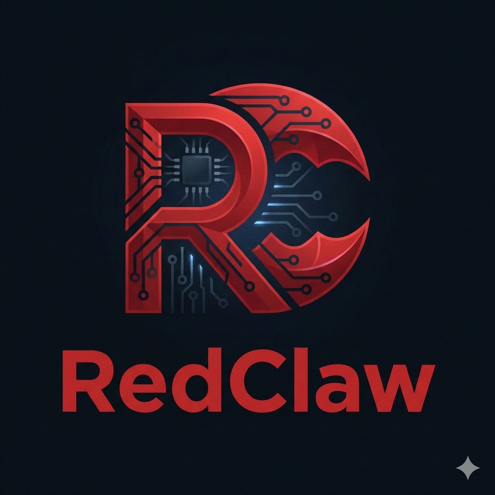
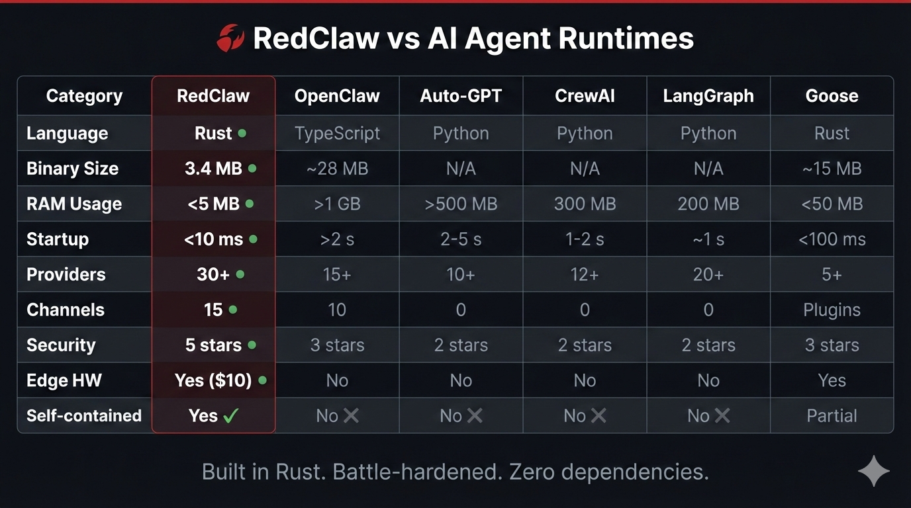
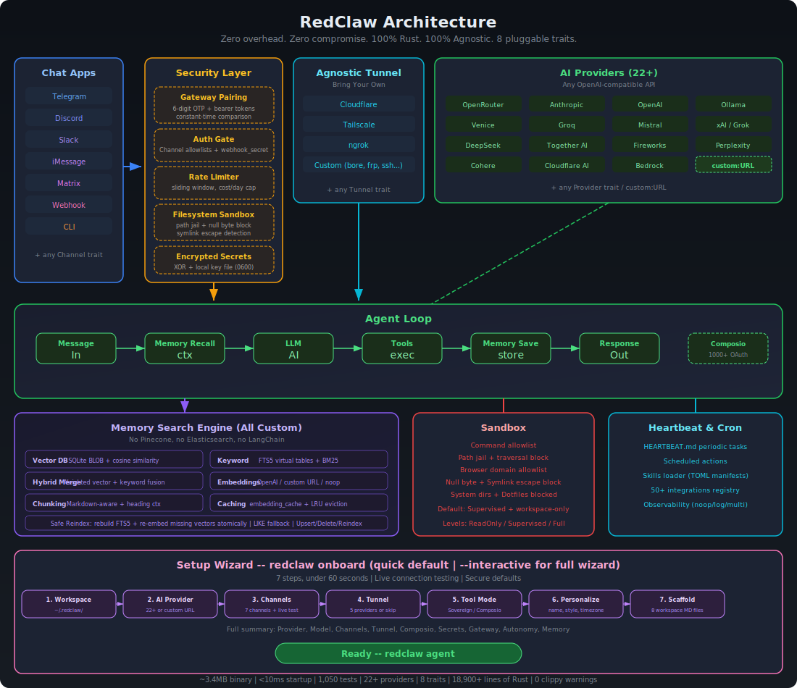

<p align="center">
  
</p>

<h1 align="center">RedClaw 🦀 (Tiếng Việt)</h1>

<p align="center">
  <strong>Không overhead. Không thỏa hiệp; triển khai mọi nơi, thay thế mọi thứ.</strong>
</p>

<p align="center">
  <a href="https://x.com/redclawlabs?s=21"></a>
  <a href="https://www.xiaohongshu.com/user/profile/67cbfc43000000000d008307?xsec_token=AB73VnYnGNx5y36EtnnZfGmAmS-6Wzv8WMuGpfwfkg6Yc%3D&xsec_source=pc_search"></a>
  <a href="https://t.me/redclawlabs"></a>
  <a href="https://t.me/redclawlabs_cn"></a>
  <a href="https://t.me/redclawlabs_ru"></a>
  <a href="https://www.reddit.com/r/redclawlabs/"></a>
</p>

<p align="center">
  🌐 Ngôn ngữ: <a href="README.md">English</a> · <a href="README.zh-CN.md">简体中文</a> · <a href="README.ja.md">日本語</a> · <a href="README.ru.md">Русский</a> · <a href="README.vi.md">Tiếng Việt</a> · <a href="README.fr.md">Français</a>
</p>

<p align="center">
  <a href="bootstrap.sh">Cài đặt 1 lệnh</a> |
  <a href="docs/getting-started/README.md">Hướng dẫn cài đặt</a> |
  <a href="docs/vi/README.md">Tổng quan tài liệu</a> |
  <a href="docs/SUMMARY.md">Mục lục tài liệu</a>
</p>

<p align="center">
  <strong>Đi nhanh theo nhu cầu:</strong>
  <a href="docs/reference/README.md">Tra cứu</a> ·
  <a href="docs/operations/README.md">Vận hành & triển khai</a> ·
  <a href="docs/troubleshooting.md">Khắc phục sự cố</a> ·
  <a href="docs/security/README.md">Bảo mật</a> ·
  <a href="docs/hardware/README.md">Phần cứng & ngoại vi</a> ·
  <a href="docs/contributing/README.md">Đóng góp & CI</a>
</p>

> Tài liệu này là bản Việt hóa được căn chỉnh thủ công từ `README.md` (ưu tiên độ chính xác và khả năng đọc; không dịch từng chữ).
>
> Tên lệnh, khóa cấu hình, đường dẫn API và tên Trait giữ nguyên tiếng Anh để tránh lệch nghĩa.
>
> Lần đồng bộ cuối: **2026-02-20**.

## 📢 Bảng thông báo

Dùng để đăng các thông báo quan trọng (breaking changes, thông báo bảo mật, cửa sổ bảo trì, vấn đề chặn phát hành, v.v.).

| Ngày (UTC) | Mức | Thông báo | Khuyến nghị |
|---|---|---|---|
| 2026-02-19 | _Khẩn cấp_ | RedClaw không liên kết với bất kỳ nguồn nào tự nhận là “chính thức” nếu không nằm trong kênh GitHub và các kênh xã hội đã xác minh. Chúng tôi đã ghi nhận các nỗ lực mạo danh dự án. | Không tải/chạy binary hoặc làm theo hướng dẫn từ nguồn không xác minh. Chỉ tin thông tin từ `github.com/redclaw-labs/redclaw` và các kênh xã hội chính thức ở phần badge. |
| 2026-02-19 | _Quan trọng_ | Hiện tại chúng tôi **chưa** có website chính thức. Nếu thấy bất kỳ hoạt động đầu tư/gây quỹ nào nhân danh RedClaw, vui lòng xem đó là đáng ngờ. | Luôn đối chiếu thông tin với repo này; theo dõi kênh X/Reddit/Telegram chính thức để nhận cập nhật. |
| 2026-02-19 | _Quan trọng_ | Anthropic cập nhật điều khoản Authentication and Credential Use (2026-02-19). Điều khoản nêu rõ OAuth authentication (Free/Pro/Max) chỉ dành cho Claude Code và Claude.ai; việc dùng OAuth token lấy từ Claude Free/Pro/Max cho sản phẩm/công cụ/dịch vụ khác (bao gồm Agent SDK) là không được phép và có thể vi phạm Consumer Terms of Service. | Để tránh rủi ro, tạm thời không thử tích hợp Claude Code OAuth. Nguồn: [Authentication and Credential Use](https://code.claude.com/docs/en/legal-and-compliance#authentication-and-credential-use). |

## Giới thiệu dự án

RedClaw là một runtime cho agent tự chủ, tối ưu cho hiệu năng, mức dùng tài nguyên và khả năng thay thế thành phần:

- Rust-native, đóng gói một binary, chạy trên ARM / x86 / RISC-V.
- Kiến trúc dựa trên Trait: `Provider` / `Channel` / `Tool` / `Memory` có thể thay thế qua cấu hình.
- Secure-by-default: pairing, allowlist rõ ràng, sandbox và giới hạn phạm vi truy cập.

## Vì sao chọn RedClaw

- **Runtime nhẹ theo mặc định**: các workflow phổ biến như CLI và `status` thường chỉ dùng vài MB RAM.
- **Dễ triển khai chi phí thấp**: hướng tới SBC giá rẻ và VM cấu hình nhỏ, không phụ thuộc runtime nặng.
- **Cold start rất nhanh**: Rust binary giúp các lệnh thường dùng và daemon khởi động gần như “mở là chạy”.
- **Khả chuyển đa kiến trúc**: một mô hình triển khai cho ARM / x86 / RISC-V, giữ nguyên khả năng thay provider/channel/tool.

## Ảnh chụp benchmark (RedClaw vs OpenClaw, có thể tái lập)

Dưới đây là so sánh nhanh tại máy cục bộ (macOS arm64, tháng 2/2026), đã chuẩn hóa theo CPU edge 0.8GHz:

| | OpenClaw | NanoBot | PicoClaw | RedClaw 🦀 |
|---|---|---|---|---|
| **Ngôn ngữ** | TypeScript | Python | Go | **Rust** |
| **RAM** | > 1GB | > 100MB | < 10MB | **< 5MB** |
| **Thời gian khởi động (core 0.8GHz)** | > 500s | > 30s | < 1s | **< 10ms** |
| **Kích thước binary** | ~28MB (dist) | N/A (script) | ~8MB | **3.4 MB** |
| **Chi phí** | Mac Mini $599 | Linux SBC ~$50 | Linux board $10 | **bất kỳ phần cứng ~$10** |

> Ghi chú: Số liệu RedClaw lấy từ build release và đo bằng `/usr/bin/time -l`. OpenClaw cần Node.js runtime (thường phát sinh ~390MB RAM riêng cho runtime). NanoBot cần Python runtime. PicoClaw và RedClaw là binary tĩnh.

<p align="center">
  
</p>

### Đo tại máy (tái lập)

Số liệu benchmark có thể thay đổi theo mã nguồn và toolchain; khuyến nghị luôn tự đo trong môi trường mục tiêu:

```bash
cargo build --release
ls -lh target/release/redclaw

/usr/bin/time -l target/release/redclaw --help
/usr/bin/time -l target/release/redclaw status
```

Số mẫu trong README (macOS arm64, 2026-02-18):

- Binary release: `8.8M`
- `redclaw --help`: ~`0.02s`, peak RAM ~`3.9MB`
- `redclaw status`: ~`0.01s`, peak RAM ~`4.1MB`

## Cài đặt 1 lệnh

```bash
git clone https://github.com/redclaw-labs/redclaw.git
cd redclaw
./bootstrap.sh
```

Tùy chọn khởi tạo cả môi trường: `./bootstrap.sh --install-system-deps --install-rust` (có thể cần `sudo`).

Chi tiết: [`docs/one-click-bootstrap.md`](docs/one-click-bootstrap.md).

## Bắt đầu nhanh

### Homebrew (macOS/Linuxbrew)

```bash
brew install redclaw
```

```bash
git clone https://github.com/redclaw-labs/redclaw.git
cd redclaw
cargo build --release --locked
cargo install --path . --force --locked

# Khởi tạo nhanh (không tương tác)
redclaw onboard --api-key sk-... --provider openrouter

# Hoặc dùng wizard tương tác
redclaw onboard --interactive

# Một lượt chat
redclaw agent -m "Hello, RedClaw!"

# Khởi động gateway (mặc định: 127.0.0.1:3000)
redclaw gateway

# Chạy chế độ dài hạn
redclaw daemon
```

## Subscription Auth (OpenAI Codex / Claude Code)

RedClaw hỗ trợ cấu hình xác thực dựa trên subscription theo kiểu native (nhiều tài khoản, lưu trữ mã hóa tĩnh).

- File cấu hình: `~/.redclaw/auth-profiles.json`
- Khóa mã hóa: `~/.redclaw/.secret_key`
- Định dạng Profile ID: `<provider>:<profile_name>` (ví dụ: `openai-codex:work`)

OpenAI Codex OAuth (subscription ChatGPT):

```bash
# Khuyến nghị cho môi trường server/headless
redclaw auth login --provider openai-codex --device-code

# Browser/callback flow (có paste fallback)
redclaw auth login --provider openai-codex --profile default
redclaw auth paste-redirect --provider openai-codex --profile default

# Kiểm tra / refresh / chuyển profile
redclaw auth status
redclaw auth refresh --provider openai-codex --profile default
redclaw auth use --provider openai-codex --profile work
```

Claude Code / Anthropic setup-token:

```bash
# Dán subscription/setup token (chế độ Authorization header)
redclaw auth paste-token --provider anthropic --profile default --auth-kind authorization

# Lệnh alias
redclaw auth setup-token --provider anthropic --profile default
```

Chạy agent với subscription auth:

```bash
redclaw agent --provider openai-codex -m "hello"
redclaw agent --provider openai-codex --auth-profile openai-codex:work -m "hello"

# Anthropic hỗ trợ cả API key và auth token qua biến môi trường:
# ANTHROPIC_AUTH_TOKEN, ANTHROPIC_OAUTH_TOKEN, ANTHROPIC_API_KEY
redclaw agent --provider anthropic -m "hello"
```

## Kiến trúc

Mỗi subsystem là một **Trait** — thay thế triển khai bằng cấu hình, không cần sửa code.

<p align="center">
  
</p>

| Subsystem | Trait | Triển khai tích hợp | Cách mở rộng |
|--------|-------|----------|----------|
| **AI model** | `Provider` | Xem qua `redclaw providers` (hiện có 28 built-in + alias, và hỗ trợ custom endpoint) | `custom:https://your-api.com` (OpenAI-compatible) hoặc `anthropic-custom:https://your-api.com` |
| **Kênh** | `Channel` | 16 kênh: CLI, Telegram, Discord, Slack, Mattermost, Linq, Matrix, Signal, WhatsApp, Email, IRC, Lark, DingTalk, QQ | Bất kỳ messaging API |
|  |  | Webhook, Nextcloud Talk |  |
| **Bộ nhớ** | `Memory` | SQLite hybrid search, PostgreSQL backend, Lucid bridge, Markdown file, explicit `none` backend, snapshot/hydrate, optional response cache | Bất kỳ backend lưu trữ |
| **Tool** | `Tool` | 22 công cụ: shell/file/memory, cron/schedule, git, pushover, browser, http_request, screenshot/image_info, composio (opt-in), delegate, tool phần cứng | Bất kỳ năng lực |
| **Quan sát** | `Observer` | Noop, Log, Multi | Prometheus, OTel |
| **Runtime** | `RuntimeAdapter` | Native, Docker (sandbox) | Thêm qua adapter; kind không hỗ trợ sẽ fail-fast |
| **Bảo mật** | `SecurityPolicy` | Gateway pairing, sandbox, allowlist, rate limits, filesystem scoping, mã hóa secrets | — |
| **Định danh** | `IdentityConfig` | OpenClaw (markdown), AIEOS v1.1 (JSON) | Bất kỳ format |
| **Tunnel** | `Tunnel` | None, Cloudflare, Tailscale, ngrok, Custom | Bất kỳ tunnel tool |
| **Heartbeat** | Engine | HEARTBEAT.md — tác vụ định kỳ | — |
| **Kỹ năng** | Loader | TOML manifest + SKILL.md instruction | Gói kỹ năng cộng đồng |
| **Tích hợp** | Registry | 70+ tích hợp trong 9 nhóm | Hệ plugin |

### Hỗ trợ runtime (hiện tại)

- ✅ Hỗ trợ: `runtime.kind = "native"` hoặc `runtime.kind = "docker"`
- 🚧 Dự kiến (chưa triển khai): WASM / edge runtime

Nếu cấu hình `runtime.kind` không hỗ trợ, RedClaw sẽ thoát với lỗi rõ ràng thay vì tự động fallback.

### Hệ thống bộ nhớ (full-stack search engine)

Tự triển khai hoàn toàn, không cần phụ thuộc ngoài — không cần Pinecone, Elasticsearch, LangChain:

| Tầng | Triển khai |
|------|------|
| **Vector DB** | Embeddings lưu dưới dạng BLOB trong SQLite, tìm kiếm theo cosine similarity |
| **Keyword search** | FTS5 virtual tables, BM25 scoring |
| **Hybrid merge** | Hàm merge trọng số tùy biến (`vector.rs`) |
| **Embeddings** | Trait `EmbeddingProvider` — OpenAI, custom URL hoặc noop |
| **Chunking** | Markdown chunker theo dòng, giữ cấu trúc heading |
| **Cache** | Bảng SQLite `embedding_cache`, chính sách LRU |
| **Re-index an toàn** | Rebuild FTS5 + re-embed vector bị thiếu theo kiểu atomic |

Agent tự động recall/store/manage bộ nhớ thông qua tools.

```toml
[memory]
backend = "sqlite"             # "sqlite", "lucid", "postgres", "markdown", "none"
auto_save = true
embedding_provider = "none"    # "none", "openai", "custom:https://..."
vector_weight = 0.7
keyword_weight = 0.3
```

## Hành vi mặc định về bảo mật (quan trọng)

- Gateway mặc định bind: `127.0.0.1:3000`
- Gateway mặc định yêu cầu pairing: `require_pairing = true`
- Mặc định từ chối public bind: `allow_public_bind = false`
- Ngữ nghĩa allowlist của channel:
  - danh sách rỗng `[]` => deny-by-default
  - `"*"` => allow all (chỉ dùng khi hiểu rõ rủi ro)

## Cấu hình thường dùng

```toml
api_key = "sk-..."
default_provider = "openrouter"
default_model = "anthropic/claude-sonnet-4.6"
default_temperature = 0.7

[memory]
backend = "sqlite"             # sqlite | lucid | markdown | none
auto_save = true
embedding_provider = "none"    # none | openai | custom:https://...

[gateway]
host = "127.0.0.1"
port = 3000
require_pairing = true
allow_public_bind = false
```

## Điều hướng tài liệu (khuyến nghị bắt đầu từ đây)

- Tổng quan docs (English): [`docs/README.md`](docs/README.md)
- Mục lục thống nhất (TOC): [`docs/SUMMARY.md`](docs/SUMMARY.md)
- Tổng quan docs (Tiếng Việt): [`docs/vi/README.md`](docs/vi/README.md)
- Command reference: [`docs/commands-reference.md`](docs/commands-reference.md)
- Config reference: [`docs/config-reference.md`](docs/config-reference.md)
- Provider reference: [`docs/providers-reference.md`](docs/providers-reference.md)
- Channel reference: [`docs/channels-reference.md`](docs/channels-reference.md)
- Runbook vận hành: [`docs/operations-runbook.md`](docs/operations-runbook.md)
- Khắc phục sự cố: [`docs/troubleshooting.md`](docs/troubleshooting.md)
- Danh mục & phân loại docs: [`docs/docs-inventory.md`](docs/docs-inventory.md)
- Snapshot triage dự án (2026-02-18): [`docs/project-triage-snapshot-2026-02-18.md`](docs/project-triage-snapshot-2026-02-18.md)

## Đóng góp & giấy phép

- Hướng dẫn đóng góp: [`CONTRIBUTING.md`](CONTRIBUTING.md)
- Quy trình PR: [`docs/pr-workflow.md`](docs/pr-workflow.md)
- Hướng dẫn reviewer: [`docs/reviewer-playbook.md`](docs/reviewer-playbook.md)
- License: MIT (xem [`LICENSE`](LICENSE) và [`NOTICE`](NOTICE))

---

Nếu bạn cần toàn bộ chi tiết triển khai (sơ đồ kiến trúc, toàn bộ lệnh, API, quy trình phát triển), hãy xem tài liệu chính bằng tiếng Anh: [`README.md`](README.md).
